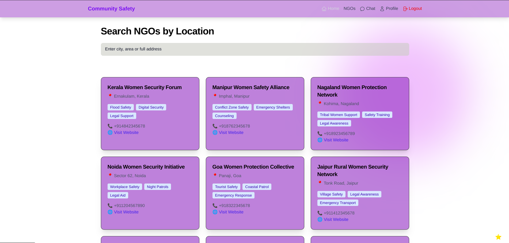

# 🌐 Community Safety Platform (CalmNest)

A full-stack community safety platform focused on women's empowerment and safety, featuring anonymous experience sharing, NGO discovery, and real-time collaboration.

 <!-- Add actual screenshot -->

## 🚀 Features

### ✨ Core Functionality
- **Anonymous Community Chat**  
  🛡️ Secure, identity-protected discussions about safety experiences  
  🌈 Randomly generated anonymous IDs with color-animal combinations  
  ⚡ Real-time messaging powered by Socket.IO

### 🗺️ NGO Discovery System
- 🔍 Geolocation-based NGO search  
  📍 Address-based filtering  
  ℹ️ Detailed NGO profiles with services and contact info

### 🔐 Security & Authentication
- 🔒 JWT-based user authentication  
  🎭 Anonymous interaction system  
  🛡️ Helmet security middleware implementation

### 💻 Technical Highlights
- 📱 Responsive UI with Tailwind CSS  
  🗃️ MongoDB database with geospatial indexing  
  🌐 RESTful API with Express.js  
  ⚛️ React-based SPA with dynamic routing

## 🛠️ Technology Stack

### Frontend (`community-safety`)
| Category          | Technologies                                                                 |
|-------------------|------------------------------------------------------------------------------|
| Core              | React 18, React Router 6, Vite 4                                            |
| State Management  | Context API, Socket.IO Client 4.7                                           |
| Styling           | Tailwind CSS 3.4, Heroicons 2.1                                             |
| Maps              | React-Leaflet 4.2                                                           |
| Animation         | Framer Motion 10.16                                                        |

### Backend (`CalmNest`)
| Category          | Technologies                                                                 |
|-------------------|------------------------------------------------------------------------------|
| Runtime           | Node.js, Express 4.18                                                       |
| Database          | MongoDB 8.12 (Mongoose ODM)                                                 |
| Security          | bcryptjs 2.4, JWT 9.0, Helmet 7.1                                           2                                                           |
| Real-time         | Socket.IO 4.7                                                               |

## ⚙️ Installation

### Prerequisites
- Node.js 18+
- MongoDB 6.0+

### Backend Setup
```bash
cd CalmNest
npm install
cp .env.example .env
# Configure environment variables
npm run dev